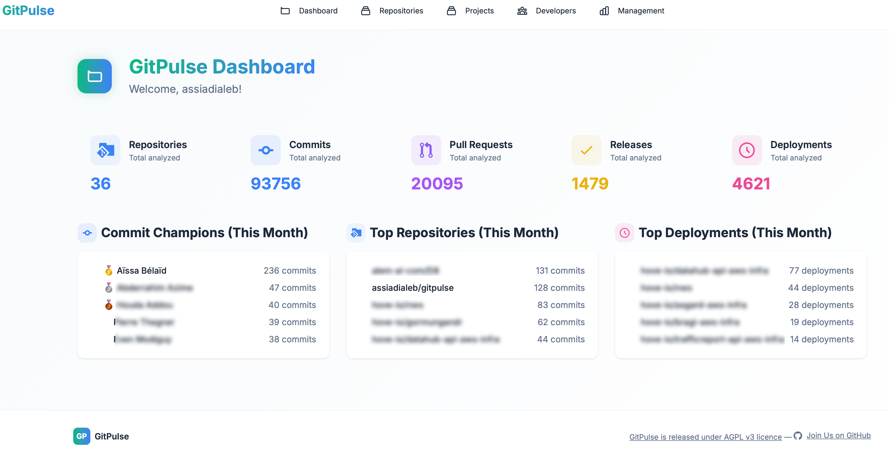

# GitPulse - GitHub Analytics Dashboard

**GitHub Analytics Dashboard for CTOs, Tech Leads, and Curious Developers**

[](https://python.org)
[](https://djangoproject.com)
[](https://www.gnu.org/licenses/agpl-3.0.en.html)

# 🧭 What is GitPulse?

**GitPulse** is an open-source dashboard designed to analyze developer activity and contribution trends within a GitHub organization.

I started building it as a **CTO** because I couldn't find a tool that was simple and reliable enough to track the activity of my teams and products. GitPulse is a **personal project**, developed during my free time. It will evolve based on my availability and interests.
Most GitHub/Git analytics tools focus on repository-level data. GitPulse lets you group multiple repositories into a single logical project — reflecting how real software is built and delivered. Perfect for tracking large apps, microservices, or monorepo-like architectures.

I'm currently building GitPulse **solo**, with no QA team. If you encounter bugs or unexpected behavior, **contributions are welcome**—as long as they stay aligned with the spirit of the project: useful, readable, and not overengineered.

<figure markdown="span">
{ width="400" }
<figcaption>GitPulse Dashboard</figcaption>
</figure>


---

## ✨ Key Features

🧩 Project-Level Aggregation: Group multiple repositories into a single product or initiative to track contributions, trends, and metrics across an entire software unit — not just per repo.

📊 Comprehensive Analytics: Track commits, pull requests, reviews, merges, and contributor activity.

👥 Developer Insights: Understand individual and team-level behaviors over time.

📈 Trend Analysis: Spot slowdowns, bottlenecks, or productivity shifts through contribution trends.

🔍 Repository Analytics: Dive into activity metrics and code quality signals per repository.

🛡️ Security Health Score: Advanced security metrics with CodeQL integration and vulnerability analysis.

⚡ Live GitHub Sync: Realtime updates powered by the GitHub API, no manual refresh.

🎯 Integrations: GitHub, CycloneDX (SBOM via GitHub), and more to come (sonarqube, Snyk...)

---


---

## 🏗️ Architecture (briefly)

GitPulse uses a modern but focused tech stack:

- **Backend**: Django 5.2+ (Python 3.12)
- **Databases**: MongoDB (analytics data) + PostgreSQL (user data)
- **Task Queue**: Django-Q
- **UI**: Responsive frontend with DaisyUI
- **Deployment**: Docker-ready with clean documentation

## 🚀 Quick Start

### Option 1: Docker 
⚠️ GitPulse is still in early development. The code and Docker setup are subject to change.
If you’re looking for a stable deployment method, please wait for the first official release.

```bash
git clone https://github.com/assiadialeb/gitpulse.git
cd GitPulse
cp env.example .env
docker-compose up -d --build
```

### Option 2: Local Installation

#### Requirements
- Python >= 3.12
- PostgreSQL
- MongoDB
- Ollama
- NPM


```bash
git clone https://github.com/assiadialeb/gitpulse.git
cd GitPulse
python -m venv venv
source venv/bin/activate  # On Windows: venv\Scripts\activate
pip install -r requirements.txt
npm install
cp env.example .env
python manage.py migrate
python manage.py runserver
```
ℹ️ Note: Don’t forget to review and adapt the .env file to match your local environment (e.g., database settings, GitHub token, debug mode, etc.).

## 🤝 Contributing

We welcome contributions! Please see our [Contributing Guide](CONTRIBUTING.md) for details.

### Development Setup

```bash
git clone https://github.com/assiadialeb/gitpulse.git
cd GitPulse
python -m venv venv
source venv/bin/activate
pip install -r requirements.txt
cp env.example .env
python manage.py migrate
python manage.py runserver
```

## 📄 License

This project is licensed under the AGPL v3 License - see the [LICENSE](licence/gnu-agpl-v3.0.md) file for details.

## 🙏 Acknowledgments
- Crafted in [Python](https://python.org)
- Built with [Django](https://djangoproject.com)
- UI powered by [DaisyUI](https://daisyui.com)
- Documentation with [MkDocs Material](https://squidfunk.github.io/mkdocs-material/)
- And yes, way too much JavaScript 😅
- Backends provided by [Postgresql](https://www.postgresql.org) and [MongoDB](https://www.mongodb.com)
- AI feature provided by [Ollama](https://ollama.org)
- Plus countless other amazing Open Source libraries that make this project possible 💜


**Crafted with ❤️ (and way too many late nights) for the tech managers community**

[GitHub](https://github.com/assiadialeb/gitpulse) • [Issues](https://github.com/assiadialeb/gitpulse/issues) • [Discussions](https://github.com/assiadialeb/gitpulse/discussions) 