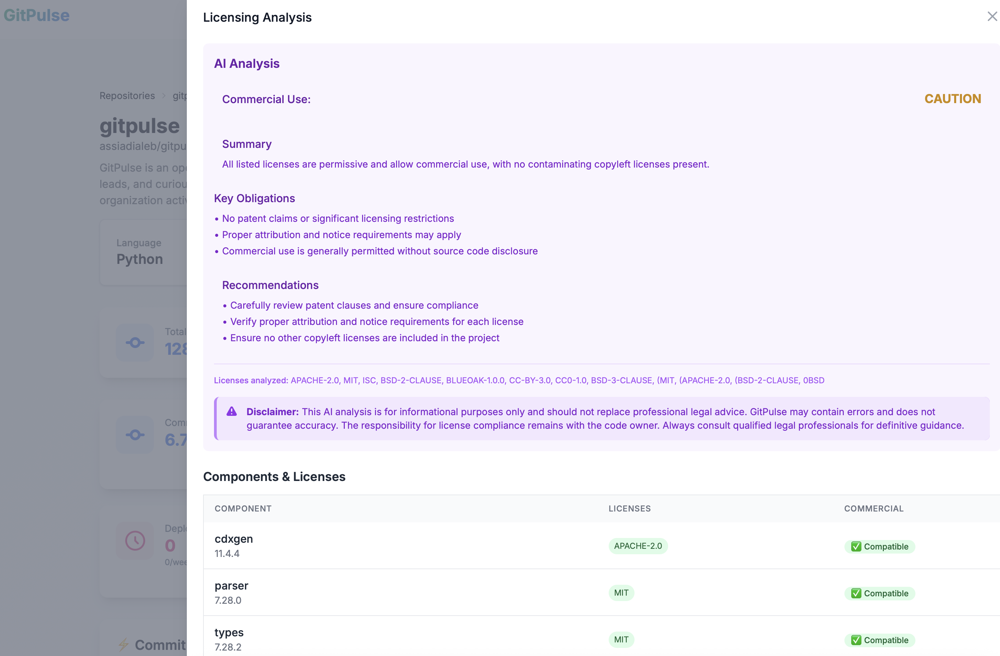

# GitPulse Overview

GitPulse is a comprehensive GitHub analytics dashboard designed to help CTOs, tech leads, and developers understand their team's productivity and code quality patterns.

## 🎯 What GitPulse Does

GitPulse analyzes your GitHub repositories to provide insights into:

- **Developer Activity**: Track individual and team contributions
- **Code Quality**: Monitor commit patterns and code review processes
- **Project Health**: Understand project progress and bottlenecks
- **Team Performance**: Identify productivity trends and areas for improvement

## 🏗️ Core Features

### 📊 Analytics Dashboard

- **Commit Analytics**: Track commit frequency, size, and patterns
- **Pull Request Metrics**: Monitor PR creation, review times, and merge rates
- **Developer Insights**: Individual and team performance metrics
- **Repository Health**: Overall project status and trends

### 👥 Developer Management

- **Developer Profiles**: Individual contributor analytics
- **Team Grouping**: Organize developers into teams
- **Activity Tracking**: Monitor daily, weekly, and monthly activity
- **Contribution Analysis**: Understand contribution patterns

### 🔍 Repository Analysis

<figure markdown="span">
{ width="200" }
<figcaption>Repository Overview</figcaption>
</figure>

- **Code Quality Metrics**: Track code quality indicators
- **Commit Classification**: AI-powered commit categorization
- **Trend Analysis**: Identify patterns over time
- **Compliance**: License compliance, dependency vulnerabilities, and code quality
<figure markdown="span">
{ width="200" }
<figcaption>Licence Compliance</figcaption>
</figure>

### 🧩 Project Management
Group multiple repositories under a single logical product view.
Track commits, PRs, and developer activity across related services or components.

- **Code Quality Metrics**: Track code quality indicators
- **Commit Classification**: AI-powered commit categorization
- **Trend Analysis**: Identify patterns over time
- **Compliance**: License compliance, dependency vulnerabilities, and code quality

### ⚡ Real-time Updates

- **Background Processing**: Automated data collection
- **Scheduled Indexing**: Regular repository updates
- **Cache Management**: Optimized performance

## 🎨 User Interface

### Key Sections

1. **Dashboard**: Overview of key metrics
2. **Repositories**: Repository management and analysis
3. **Projects**: Group repositories 
4. **Developers**: Individual analytics
5. **Settings**: Configuration and preferences

## 🚀 Getting Started

### First Steps

1. **Create Account**: Sign up and create your profile
2. **Connect GitHub**: Link your GitHub account
3. **Add Projects**: Select repositories to analyze
4. **Explore Dashboard**: View your analytics

## 📈 Key Metrics

### Developer Metrics

- **Commit Frequency**: Daily, weekly, monthly commits
- **Code Review Participation**: PR reviews and feedback
- **Contribution Distribution**: Files and areas of focus
- **Activity Patterns**: Peak activity times and trends

### Project Metrics

- **Repository Health**: Overall project status
- **Code Quality**: Quality indicators and trends
- **Team Collaboration**: Cross-team contributions
- **Release Cycles**: Deployment and release patterns

## 🔐 Security & Privacy

### Data Protection

- All your data stored in your datacenter

### GitHub Integration

- **Read-only Access**: Only reads repository data
- **User Consent**: Explicit permission required
- **Data Minimization**: Only collects necessary data
- **Secure Storage**: Encrypted data storage