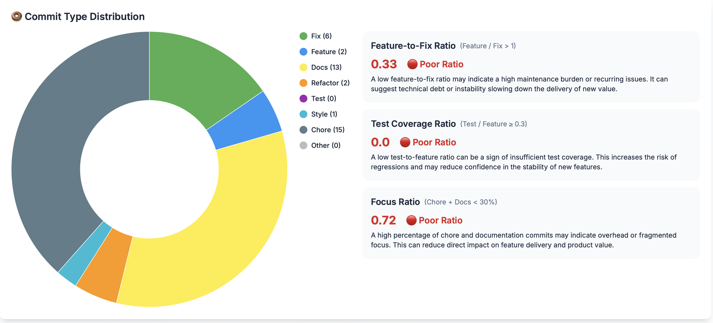
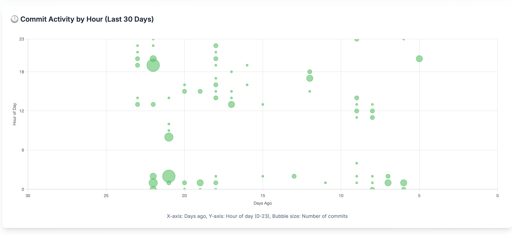

# GitPulse Overview

GitPulse is a comprehensive GitHub analytics dashboard designed to help CTOs, tech leads, and developers understand their team's productivity and code quality patterns.

## 🎯 What GitPulse Does

GitPulse analyzes your GitHub repositories to provide insights into:

- **Developer Activity**: Track individual and team contributions
- **Code Quality**: Monitor commit patterns and code review processes
- **Project Health**: Understand project progress and bottlenecks
- **Team Performance**: Identify productivity trends and areas for improvement

## 🏗️ Core Features

### 📊 Analytics Dashboard

- **Commit Analytics**: Track commit frequency, size, and patterns
- **Pull Request Metrics**: Monitor PR creation, review times, and merge rates
- **Developer Insights**: Individual and team performance metrics
- **Repository Health**: Overall project status and trends

### 👥 Developer Management

- **Developer Profiles**: Individual contributor analytics
- **Team Grouping**: Organize developers into teams
- **Activity Tracking**: Monitor daily, weekly, and monthly activity
- **Contribution Analysis**: Understand contribution patterns

### 🔍 Repository Analysis

This screen provides a high-level overview of repository activity, developer contributions, and key health indicators. It aggregates commit frequency, pull request metrics, licensing compliance, and vulnerability scans to give tech leads and managers a quick snapshot of project vitality and team productivity.
It includes commit/change statistics, PR cycle time, release cadence, and deployment frequency—offering both raw numbers and computed scores for immediate insight.

<figure markdown="span">
{ width="200" }
<figcaption>Repository Overview</figcaption>
</figure>

- **Code Quality Metrics**: “Track code quality indicators”

(coming soon)

- **Commit Frequency**: “Quantifying coding rhythm and consistency”

This panel evaluates how frequently and consistently code is pushed to the repository, providing a set of scores to assess recent development momentum:

- Recent Activity Score: Reflects the proportion of commits made in the last 30 days relative to the last 90 days. A score of 100 indicates high recent engagement.
- Consistency Score: Measures how regularly commits occur over time, highlighting the steadiness of contributions.
- Overall Frequency Score: A weighted score that combines average commit frequency, recency, and consistency into a single global indicator of activity health.
- Commits Last 30 Days: Raw count of commits over the last month.
- Active Days: Total days with at least one commit activity—used to assess daily engagement.

A tooltip expands to explain the formulas used for each score, making the metrics transparent and easy to interpret.

<figure markdown="span">
{ width="200" }
<figcaption>Commit Frequency</figcaption>
</figure>

- **Commit Classification**: “AI-powered commit categorization”

This view breaks down the types of commits in the codebase—features, fixes, refactors, chores, etc.—giving a clear picture of development focus.
It also provides key derived ratios:

- Feature-to-Fix Ratio shows a high focus on new features over bug fixing—suggesting code stability.
- Test Coverage Ratio indicates a lack of test-related commits, which could affect confidence in software quality.
- Focus Ratio evaluates the balance between product-driven work and infrastructure/documentation efforts, showing a healthy distribution.

This section helps assess team priorities and code maturity at a glance.

<figure markdown="span">
{ width="200" }
<figcaption>Commit Classification</figcaption>
</figure>
- **Trend Analysis**: Identify patterns over time

This bubble chart maps commit activity over the last 30 days, plotted by hour of day.
Each bubble’s size represents the number of commits at a given time and date.

This visualization helps identify:

- Typical working hours or unusual activity times
- Periods of intense development or inactivity
- Patterns across different days and times

It’s useful for understanding team habits and optimizing collaboration or review windows.

<figure markdown="span">
{ width="200" }
<figcaption>Commit Trend Analysis</figcaption>
</figure>

- **Release Frequency**: “Shipping velocity and code review responsiveness”

This section helps assess how often code is being shipped and how efficiently pull requests are processed.

It shows:

- Average releases per month and week
- PR Cycle Time (median and average): the time between opening and merging PRs
- Total number of PRs analyzed during the selected period

These metrics reveal how quickly changes reach production, highlighting the team’s delivery velocity and responsiveness.

<figure markdown="span">
{ width="200" }
<figcaption>Release Cadence & PR Efficiency</figcaption>
</figure>

- **Compliance**: “License compliance, dependency vulnerabilities, and code quality”

This view provides a summary of the licensing status of all detected components within the project. It includes:

- AI-Powered Legal Summary: Automatically generated insights on whether licenses permit commercial use and pose compliance risks.
- Key Obligations & Recommendations: Clearly outlines licensing duties (e.g., attribution, patent clauses) and best practices to follow.
- License Compatibility Table: Shows each package, its license (MIT, Apache-2.0, etc.), and whether it’s safe for commercial use.
- Legal Disclaimer: States that this analysis is informational and does not replace legal review.

The “Caution” warning signals that while no blocking licenses were found, a careful review is still recommended for full compliance assurance.

<figure markdown="span">
{ width="200" }
<figcaption>Licence Compliance</figcaption>
</figure>

### 🧩 Project Management
Group multiple repositories under a single logical product view.
Track commits, PRs, and developer activity across related services or components.

- **Code Quality Metrics**: Track code quality indicators
- **Commit Classification**: AI-powered commit categorization
- **Trend Analysis**: Identify patterns over time
- **Compliance**: License compliance, dependency vulnerabilities, and code quality

### ⚡ Real-time Updates

- **Background Processing**: Automated data collection
- **Scheduled Indexing**: Regular repository updates
- **Cache Management**: Optimized performance

## 🎨 User Interface

### Key Sections

1. **Dashboard**: Overview of key metrics
2. **Repositories**: Repository management and analysis
3. **Projects**: Group repositories 
4. **Developers**: Individual analytics
5. **Settings**: Configuration and preferences

## 🚀 Getting Started

### First Steps

1. **Create Account**: Sign up and create your profile
2. **Connect GitHub**: Link your GitHub account
3. **Add Projects**: Select repositories to analyze
4. **Explore Dashboard**: View your analytics

## 📈 Key Metrics

### Developer Metrics

- **Commit Frequency**: Daily, weekly, monthly commits
- **Code Review Participation**: PR reviews and feedback
- **Contribution Distribution**: Files and areas of focus
- **Activity Patterns**: Peak activity times and trends

### Project Metrics

- **Repository Health**: Overall project status
- **Code Quality**: Quality indicators and trends
- **Team Collaboration**: Cross-team contributions
- **Release Cycles**: Deployment and release patterns

## 🔐 Security & Privacy

### Data Protection

- All your data stored in your datacenter

### GitHub Integration

- **Read-only Access**: Only reads repository data
- **User Consent**: Explicit permission required
- **Data Minimization**: Only collects necessary data
- **Secure Storage**: Encrypted data storage