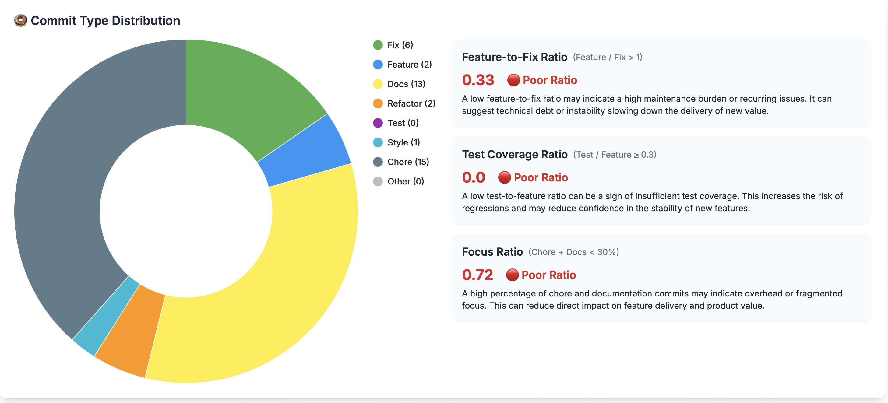

# Commit Classification

GitPulse uses AI-powered analysis to automatically categorize commits, providing insights into development focus and team priorities.

## AI-Powered Commit Analysis

GitPulse analyzes commit messages and changes to automatically classify commits into meaningful categories, helping you understand what your team is working on.

<figure markdown="span">
{ width="400" }
<figcaption>Commit Type Distribution</figcaption>
</figure>

## Commit Categories

### Feature Development

Commits that add new functionality or features:

- **New Features**: Brand new functionality
- **Feature Enhancements**: Improvements to existing features
- **User Interface**: UI/UX changes and improvements
- **API Extensions**: New endpoints or API changes

**What it tells you:**
- How much effort goes into new development
- Whether the team is focused on growth
- Product development velocity

### Bug Fixes

Commits that address issues and problems:

- **Bug Fixes**: Corrections to existing functionality
- **Hotfixes**: Urgent fixes for critical issues
- **Regression Fixes**: Fixes for recently broken features
- **Performance Fixes**: Optimizations and speed improvements

**What it tells you:**
- Code quality and stability
- How much time is spent on maintenance
- Whether new features are causing issues

### Code Quality

Commits focused on improving code structure:

- **Refactoring**: Code restructuring without changing behavior
- **Code Cleanup**: Removing dead code and improving readability
- **Architecture Changes**: Structural improvements
- **Technical Debt**: Addressing accumulated issues

**What it tells you:**
- Code maintenance practices
- Technical debt management
- Code quality focus

### Testing

Commits related to testing and quality assurance:

- **Test Additions**: New test cases and coverage
- **Test Fixes**: Corrections to existing tests
- **Test Infrastructure**: Testing framework improvements
- **Integration Tests**: End-to-end testing

**What it tells you:**
- Quality assurance practices
- Test coverage priorities
- Testing culture maturity

### Documentation

Commits that improve project documentation:

- **README Updates**: Project documentation improvements
- **API Documentation**: Code documentation
- **User Guides**: User-facing documentation
- **Technical Docs**: Developer documentation

**What it tells you:**
- Documentation practices
- Knowledge sharing focus
- Project maturity

### Infrastructure

Commits related to deployment and infrastructure:

- **CI/CD Changes**: Pipeline improvements
- **Deployment Updates**: Release and deployment changes
- **Environment Config**: Configuration management
- **DevOps Tools**: Infrastructure automation

**What it tells you:**
- DevOps maturity
- Deployment practices
- Infrastructure focus

### Dependencies

Commits that update external dependencies:

- **Package Updates**: Dependency version updates
- **Security Updates**: Security-related dependency changes
- **New Dependencies**: Adding new libraries
- **Dependency Cleanup**: Removing unused dependencies

**What it tells you:**
- Dependency management practices
- Security awareness
- Technical debt management

## Key Ratios and Metrics

### Feature-to-Fix Ratio

Measures the balance between new development and maintenance:

- **High Ratio (3:1+)**: Heavy focus on new features
- **Balanced Ratio (1:1-2:1)**: Good balance of features and fixes
- **Low Ratio (<1:1)**: More maintenance than new development

**What it tells you:**
- Whether the team is growing or maintaining
- Code stability and quality
- Product development stage

### Test Coverage Ratio

Measures the proportion of testing-related commits:

- **High Ratio (20%+)**: Strong testing culture
- **Medium Ratio (10-20%)**: Good testing practices
- **Low Ratio (<10%)**: Limited testing focus

**What it tells you:**
- Quality assurance maturity
- Risk management practices
- Code confidence levels

### Focus Ratio

Measures the balance between product work and infrastructure:

- **High Ratio (80%+)**: Heavy product focus
- **Balanced Ratio (60-80%)**: Good product/infrastructure balance
- **Low Ratio (<60%)**: More infrastructure than product work

**What it tells you:**
- Team priorities and focus
- Technical debt vs. feature development
- Platform maturity

## Troubleshooting

### Common Issues

#### Poor Classification Accuracy
- **Cause**: Unclear or inconsistent commit messages
- **Solution**: Establish clear commit message guidelines

#### Missing Categories
- **Cause**: Commits don't fit existing categories
- **Solution**: Review and update classification rules

#### Inconsistent Ratios
- **Cause**: Team not following commit standards
- **Solution**: Provide training and establish guidelines

### Getting Help

- **Team Guidelines**: Establish clear commit standards
- **Training Sessions**: Provide commit message training
- **Tool Integration**: Use tools that improve commit quality
- **Regular Reviews**: Discuss commit patterns regularly

## 📚 Related Documentation

- **[Commit Frequency](commit-frequency.md)** - Development activity tracking
- **[Activity Trends](activity-trends.md)** - Time-based patterns
- **[Repository Overview](overview.md)** - Complete repository analytics
- **[Developer Analytics](../developers/overview.md)** - Individual developer insights 