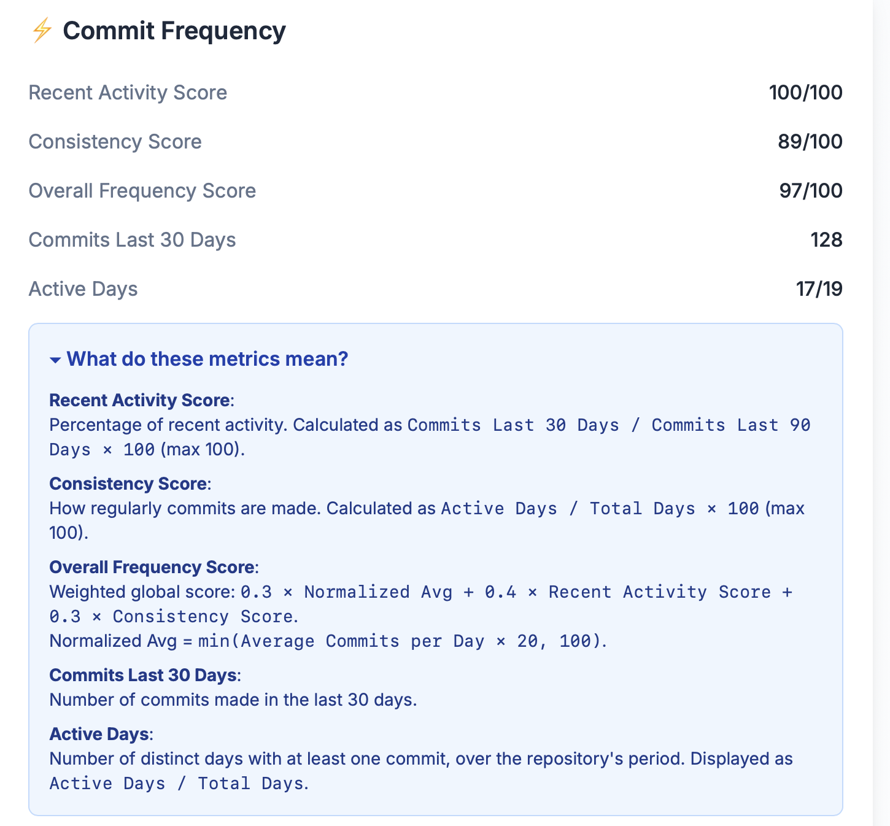
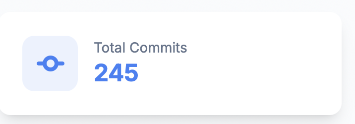
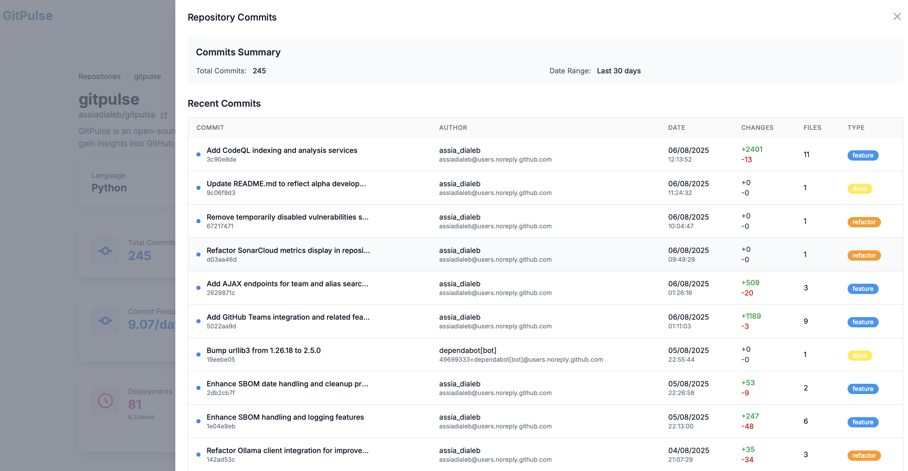
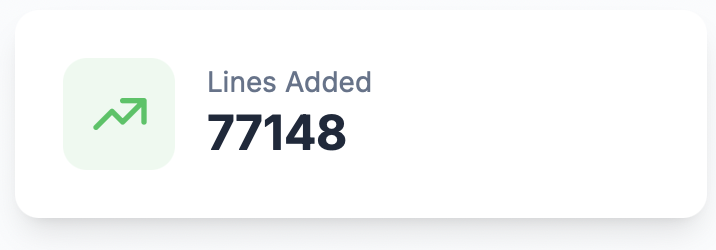
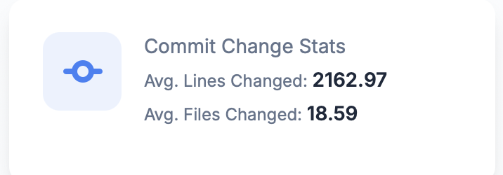
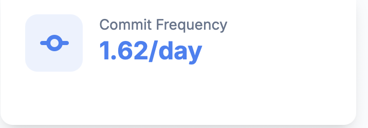
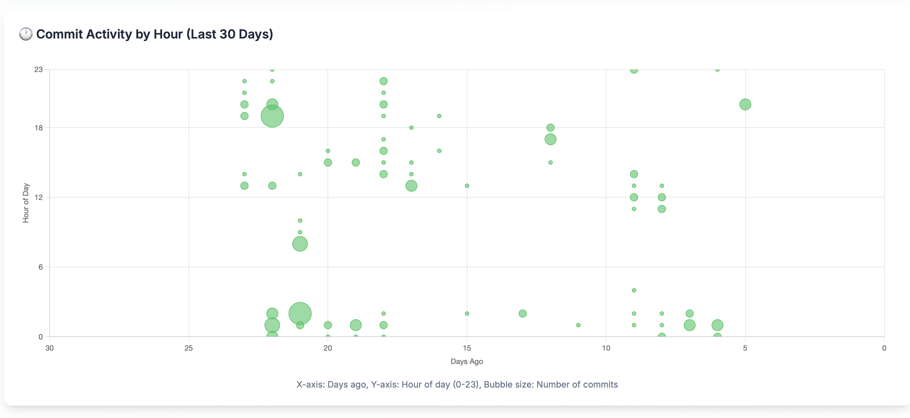

# Commit Frequency & Development Activity

GitPulse tracks commit patterns and development activity to help you understand your team's productivity and development rhythm.

## Development Activity Overview

The commit frequency analysis provides insights into how your team develops code, identifying patterns, trends, and opportunities for improvement.

<figure markdown="span">
{ width="400" }
<figcaption>Commit Frequency Analysis</figcaption>
</figure>

## Key Activity Metrics

### Total Commits

The total number of commits in the selected time period. This metric provides a basic count of development activity and can be filtered by date range to focus on specific periods.

<figure markdown="span">
{ width="200" }
<figcaption>Total Commits</figcaption>
</figure>

**What it tells you:**
- Overall development volume
- Activity level compared to previous periods
- Development momentum and engagement

### Commits Details

Click on the Total Commits metric to access a detailed breakdown showing:
- Individual commit details
- Commit messages and descriptions
- Developer attribution
- File changes and impact

<figure markdown="span">
{ width="400" }
<figcaption>Commits Details</figcaption>
</figure>

### Lines Added

The total number of lines of code added during the selected period. This metric tracks code growth and development progress.
<figure markdown="span">
{ width="200" }
<figcaption>Lines Added</figcaption>
</figure>

**What it tells you:**
- Code expansion rate
- Development velocity
- Feature development progress

### Commit Change Stats

Detailed statistics about code changes including:
- Lines added vs. lines removed
- File modification patterns
- Change distribution across the codebase

<figure markdown="span">
{ width="200" }
<figcaption>Commit Change Stats</figcaption>
</figure>

**What it tells you:**
- Development vs. maintenance balance
- Code churn and stability
- Refactoring vs. new feature development

### Commit Frequency

The rate at which commits are made over time, measured as commits per day, week, or month depending on the selected time period.

<figure markdown="span">
{ width="200" }
<figcaption>Commit Frequency</figcaption>
</figure>

**What it tells you:**
- Development rhythm and consistency
- Team productivity patterns
- Project activity health

## Advanced Activity Metrics

### Recent Activity Score

<figure markdown="span">
{ width="400" }
<figcaption>Commit Frequency Score</figcaption>
</figure>

Measures the proportion of commits made in the last 30 days relative to the last 90 days:

- **100**: High recent engagement
- **80-99**: Good recent activity
- **60-79**: Moderate recent activity
- **40-59**: Low recent activity
- **0-39**: Very low recent activity

**What it tells you:**
- Whether development is accelerating or slowing
- If the team is actively working on the project
- Recent momentum compared to historical patterns

### Consistency Score

Measures how regularly commits occur over time:

- **100**: Very consistent development rhythm
- **80-99**: Good consistency
- **60-79**: Moderate consistency
- **40-59**: Irregular patterns
- **0-39**: Very inconsistent development

**What it tells you:**
- Whether development follows a predictable schedule
- If the team has established good habits
- How well the development process is structured

### Overall Frequency Score

A weighted score combining average commit frequency, recency, and consistency:

- **100**: Excellent development health
- **80-99**: Good development health
- **60-79**: Fair development health
- **40-59**: Poor development health
- **0-39**: Critical development health

**What it tells you:**
- Overall assessment of development activity
- Whether the project is healthy and active
- If intervention is needed to improve productivity

## Activity Breakdown

### Commits Last 30 Days

Raw count of commits over the last month:

- **High (50+)**: Very active development
- **Medium (20-49)**: Normal development activity
- **Low (5-19)**: Light development activity
- **Very Low (0-4)**: Minimal development activity

### Active Days

Total days with at least one commit activity:

- **High (20+ days)**: Consistent daily development
- **Medium (10-19 days)**: Regular development
- **Low (5-9 days)**: Intermittent development
- **Very Low (0-4 days)**: Rare development activity

## Time-Based Analysis

### Commit Activity by Hour

This visualization shows when commits occur throughout the day:

<figure markdown="span">
{ width="400" }
<figcaption>Daily Commit Patterns</figcaption>
</figure>

**What it reveals:**
- **Peak Hours**: When the team is most active
- **Working Patterns**: Typical development schedules
- **Global Teams**: Multiple timezone activity
- **Overtime Patterns**: After-hours development

### Weekly Patterns

Track activity across different days of the week:

- **Monday**: Start-of-week activity levels
- **Midweek**: Peak development days
- **Friday**: End-of-week patterns
- **Weekend**: Off-hours development

## Development Health Indicators

### Healthy Development Patterns

✅ **Good signs:**
- Consistent daily commits
- Regular activity throughout the week
- Balanced distribution across team members
- Steady progress over time

### Warning Signs

⚠️ **Concerning patterns:**
- Long periods without commits
- All activity concentrated in few days
- Single developer doing most work
- Declining activity over time

## 📚 Related Documentation

- **[Commit Classification](commit-classification.md)** - AI-powered commit categorization
- **[Activity Trends](activity-trends.md)** - Time-based development patterns
- **[Repository Overview](overview.md)** - Complete repository analytics
- **[Developer Analytics](../developers/overview.md)** - Individual developer insights 