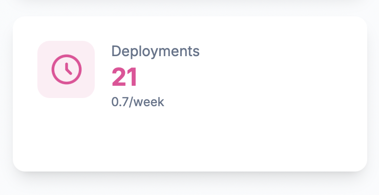
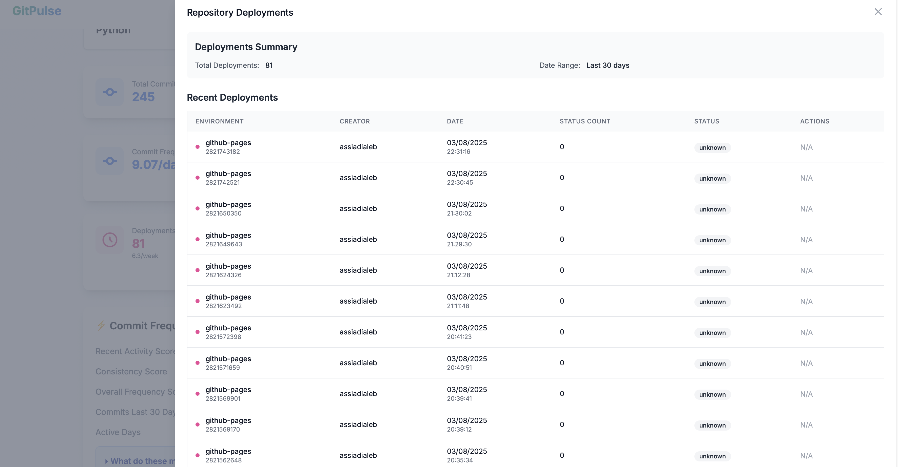

# Deployment Analytics

GitPulse tracks deployment patterns and metrics to help you understand your team's deployment frequency and infrastructure management effectiveness.

## Deployment Overview

Deployment analytics provide insights into how your team deploys code, manages infrastructure, and maintains a consistent deployment cadence.

## Key Deployment Metrics

### Total Deployments

The total number of deployments created in the selected time period. This metric provides a basic count of deployment activity and can be filtered by date range to focus on specific periods.

<figure markdown="span">
{ width="200" }
<figcaption>Total Deployments</figcaption>
</figure>

**What it tells you:**
- Overall deployment volume
- Infrastructure management activity
- Application delivery pace

### Deployment Details

Click on the Total Deployments metric to access a detailed breakdown showing:
- Individual deployment details and descriptions
- Deployment dates and environments
- Deployment status and outcomes
- Associated commits and releases

<figure markdown="span">
{ width="400" }
<figcaption>Deployment Details</figcaption>
</figure>

**What it tells you:**
- Deployment history and patterns
- Environment usage and distribution
- Deployment success rates and quality

### Deployment Frequency

The rate at which deployments are created, measured as deployments per week over the selected time period.

<figure markdown="span">
{ width="200" }
<figcaption>Deployment Frequency</figcaption>
</figure>

**What it tells you:**
- Deployment cadence
- Infrastructure rhythm and consistency
- Team delivery velocity

## Deployment Frequency Details

### Deployments per Week

The average number of deployments created per week over the selected time period (default: 90 days).

**What it tells you:**
- Weekly deployment pace
- Deployment planning effectiveness
- Infrastructure delivery rhythm

### Period Analysis

The deployment frequency is calculated over a configurable period (default: 90 days) to provide meaningful averages and trends.

**What it tells you:**
- Deployment consistency over time
- Seasonal patterns in deployment activity
- Long-term deployment trends

## Deployment Health Indicators

### Healthy Deployment Patterns

✅ **Good signs:**
- Consistent deployment frequency
- Regular deployment cadence
- Successful deployment outcomes
- Stable deployment process

### Warning Signs

⚠️ **Concerning patterns:**
- Irregular deployment frequency
- Long periods without deployments
- High deployment failure rates
- Inconsistent deployment quality

## Using Deployment Data

### For Development Teams

1. **Deployment Planning**: Monitor deployment frequency and plan accordingly
2. **Process Optimization**: Identify bottlenecks in deployment process
3. **Quality Assurance**: Ensure deployments are successful and well-documented
4. **Infrastructure Coordination**: Coordinate deployments across environments

### For Management

1. **Delivery Velocity**: Assess application delivery pace
2. **Process Efficiency**: Monitor deployment process effectiveness
3. **Quality Control**: Track deployment success rates
4. **Capacity Planning**: Understand deployment workload and timing

## Best Practices

### Improving Deployment Process

1. **Consistent Cadence**: Establish regular deployment schedules
2. **Quality Gates**: Implement deployment quality checks
3. **Documentation**: Maintain clear deployment logs
4. **Automation**: Streamline deployment process with automation

### Team Collaboration

1. **Deployment Planning**: Coordinate deployments across teams
2. **Communication**: Keep stakeholders informed of deployment timing
3. **Testing**: Ensure thorough testing before deployments
4. **Feedback**: Gather feedback on deployment process

## Troubleshooting

### Common Issues

#### Irregular Deployment Frequency
- **Cause**: Inconsistent deployment planning or process
- **Solution**: Establish regular deployment cadence and automation

#### Poor Deployment Documentation
- **Cause**: Insufficient deployment logs or tracking
- **Solution**: Implement mandatory deployment documentation

#### Deployment Bottlenecks
- **Cause**: Manual processes or insufficient testing
- **Solution**: Automate deployment process and improve testing

### Getting Help

- **Process Reviews**: Regularly assess deployment workflow
- **Team Training**: Provide deployment best practices
- **Tool Configuration**: Ensure deployment tools are optimized
- **Feedback Loops**: Gather team input on deployment process

## 📚 Related Documentation

- **[Commit Frequency](commit-frequency.md)** - Development activity tracking
- **[Pull Requests](pull-requests.md)** - Code review process
- **[Releases](releases.md)** - Release management
- **[Repository Overview](overview.md)** - Complete repository analytics
- **[Developer Analytics](../developers/overview.md)** - Individual developer insights 