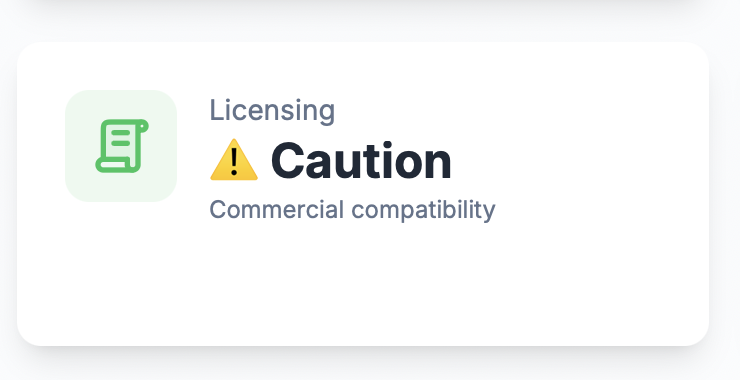

# Licensing Analytics

GitPulse analyzes software licenses and SBOM (Software Bill of Materials) components to help you understand license compliance and commercial compatibility.

## What is SBOM?

A Software Bill of Materials (SBOM) is a formal, machine-readable inventory of software components and dependencies. It provides a detailed list of all the open source and third-party components used in your software, including their versions, licenses, and security vulnerabilities.

**Why SBOM matters:**
- **Transparency**: Complete visibility into your software supply chain
- **Compliance**: Track license obligations and restrictions
- **Security**: Identify vulnerable dependencies
- **Risk Management**: Assess legal and security risks

## License Overview

License analytics provide insights into the legal implications of your software dependencies and help ensure compliance with open source licenses.

## Key License Metrics

### Commercial Compatibility

A simple indicator showing whether your software's dependencies are compatible with commercial use.

<figure markdown="span">
{ width="200" }
<figcaption>Commercial Compatibility</figcaption>
</figure>

**What it tells you:**
- Whether your software can be used commercially
- Legal risk assessment
- License compliance status

### License Analysis Details

Click on the Commercial Compatibility metric to access a comprehensive AI-powered analysis showing:
- Detailed legal analysis of all licenses
- Component-by-component license breakdown
- Legal obligations and restrictions
- Compliance recommendations

<figure markdown="span">
{ width="400" }
<figcaption>License Analysis Details</figcaption>
</figure>

**What it tells you:**
- Complete legal assessment
- Specific license obligations
- Risk mitigation strategies
- Compliance requirements

## License Categories

### Commercial-Friendly Licenses

Licenses that allow commercial use with minimal restrictions:
- **MIT**: Very permissive, allows commercial use
- **Apache 2.0**: Permissive with patent protection
- **BSD**: Simple permissive license
- **ISC**: Simplified BSD license
- **Unlicense**: Public domain dedication

**What it tells you:**
- Safe for commercial use
- Minimal legal obligations
- Maximum flexibility

### Copyleft Licenses

Licenses that require source code sharing under certain conditions:
- **GPL**: Requires source code sharing when distributing
- **AGPL**: Requires source code sharing even for network use
- **LGPL**: Less restrictive copyleft for libraries
- **MPL**: Moderate copyleft with file-level requirements

**What it tells you:**
- May require source code disclosure
- Can affect commercial licensing
- Need careful legal review

## License Health Indicators

### Healthy License Patterns

✅ **Good signs:**
- All components have commercial-friendly licenses
- Clear license documentation
- No conflicting license obligations
- Proper attribution requirements met

### Warning Signs

⚠️ **Concerning patterns:**
- Copyleft licenses present
- Mixed license types
- Unclear license obligations
- Missing license information

## Using License Data

### For Development Teams

1. **Dependency Selection**: Choose components with compatible licenses
2. **License Tracking**: Monitor license changes in dependencies
3. **Compliance Management**: Ensure proper attribution and obligations
4. **Risk Assessment**: Identify potential legal issues early

### For Management

1. **Legal Risk Assessment**: Understand potential legal implications
2. **Compliance Planning**: Plan for license obligations
3. **Commercial Strategy**: Assess impact on business model
4. **Due Diligence**: Support legal review processes

## Best Practices

### Improving License Compliance

1. **License Review**: Review licenses before adding dependencies
2. **Documentation**: Maintain clear license documentation
3. **Attribution**: Provide proper license attribution
4. **Monitoring**: Regularly review license compliance

### Team Collaboration

1. **Legal Consultation**: Work with legal experts for complex licenses
2. **Training**: Educate team on license implications
3. **Process**: Establish license review processes
4. **Automation**: Use tools to track license changes

## Troubleshooting

### Common Issues

#### Copyleft Licenses Detected
- **Cause**: Dependencies with GPL, AGPL, or other copyleft licenses
- **Solution**: Review license implications and consider alternatives

#### Missing License Information
- **Cause**: Components without clear license information
- **Solution**: Contact maintainers or find alternative components

#### License Conflicts
- **Cause**: Incompatible licenses in the same project
- **Solution**: Review legal implications and consider alternatives

### Getting Help

- **Legal Review**: Consult with legal experts for complex licenses
- **Documentation**: Review license documentation thoroughly
- **Community**: Seek guidance from open source communities
- **Tools**: Use automated license compliance tools

## 📚 Related Documentation

- **[Security Health Score](security-health-score.md)** - Security metrics
- **[SonarCloud Metrics](sonarcloud-metrics.md)** - Code quality analysis
- **[Repository Overview](overview.md)** - Complete repository analytics
- **[Developer Analytics](../developers/overview.md)** - Individual developer insights 