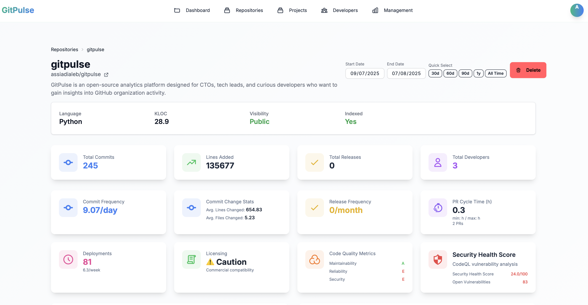

# Repository Analytics Overview

GitPulse provides comprehensive analytics for individual repositories, helping you understand code quality, development patterns, and security posture.

## Repository Dashboard

The repository detail page offers a complete view of your codebase health and development activity. Each repository displays key metrics organized into intuitive sections:

<figure markdown="span">
{ width="400" }
<figcaption>Repository Overview Dashboard</figcaption>
</figure>

## Key Metrics Sections

### Security Health Score (SHS)
Advanced security metrics using CodeQL integration to evaluate vulnerability density and severity.

- **Real-time Security Assessment**: Continuous monitoring of security posture
- **Vulnerability Analysis**: Critical, High, Medium, and Low severity tracking
- **Trend Monitoring**: Security improvement or deterioration over time
- **Size-Normalized Scoring**: Fair comparison across repositories of different sizes

### Code Quality Metrics
SonarCloud integration provides comprehensive code quality analysis:

- **Maintainability**: Code complexity and technical debt assessment
- **Reliability**: Bug density and reliability rating
- **Security**: Security hotspots and vulnerabilities
- **Coverage**: Test coverage percentage

### Development Activity
Track commit patterns and developer contributions:

- **Commit Frequency**: Development rhythm and consistency
- **Developer Activity**: Individual and team contribution patterns
- **Activity Trends**: Peak development times and patterns
- **Contribution Distribution**: Files and areas of focus

### Repository Size Analysis
KLOC (Kilo Lines of Code) tracking:

- **Current Size**: Total lines of code in the repository
- **Historical Tracking**: Size evolution over time
- **Growth Patterns**: Repository expansion trends

## Interactive Features

### Date Range Selection
Filter analytics by time periods to focus on specific development phases or compare different periods.

### Slide-over Panels
Click on metric cards to access detailed breakdowns and historical data.

### Export Options
Download data for external analysis or reporting.

## Repository Management

### Adding Repositories
1. Navigate to the Repositories page
2. Click "Index Repository"
3. Select from your GitHub repositories
4. Configure analysis settings

### Repository Settings
- **Indexing Frequency**: Control how often data is updated
- **Integration Settings**: Configure CodeQL and SonarCloud
- **Access Control**: Manage who can view repository analytics

## Analytics Deep Dive

### Security Analysis
- **[Security Health Score](security-health-score.md)**: Advanced security metrics
- **[CodeQL Integration](codeql-integration.md)**: Vulnerability detection and analysis
- **[Vulnerability Tracking](vulnerability-tracking.md)**: Severity and remediation

### Code Quality
- **[SonarCloud Metrics](sonarcloud-metrics.md)**: Maintainability, reliability, and security
- **[Quality Gates](quality-gates.md)**: Pass/fail criteria and thresholds
- **[Technical Debt](technical-debt.md)**: Code complexity and improvement areas

### Development Activity
- **[Commit Frequency](commit-frequency.md)**: Development rhythm and consistency
- **[Commit Classification](commit-classification.md)**: AI-powered commit categorization
- **[Activity Trends](activity-trends.md)**: Time-based development patterns

### Repository Metrics
- **[KLOC Analysis](kloc-analysis.md)**: Repository size and growth tracking
- **[File Analysis](file-analysis.md)**: Code organization and structure

## Best Practices

### Regular Monitoring
- Check repository analytics weekly for trends
- Monitor security metrics for new vulnerabilities
- Track code quality improvements over time

### Actionable Insights
- Use metrics to guide development decisions
- Prioritize security fixes based on SHS trends
- Plan refactoring based on code quality metrics

### Team Communication
- Share insights with development teams
- Use analytics in sprint planning and retrospectives
- Track improvement initiatives with historical data

## Troubleshooting

### Missing Data
- Verify repository indexing status
- Check GitHub token permissions
- Ensure integrations are properly configured

### Outdated Metrics
- Run manual indexing commands
- Check integration service status
- Verify API rate limits

## 📚 Related Documentation

- **[Security Health Score](security-health-score.md)** - Advanced security metrics
- **[CodeQL Integration](codeql-integration.md)** - Vulnerability analysis
- **[SonarCloud Metrics](sonarcloud-metrics.md)** - Code quality analysis
- **[Commit Analytics](commit-analytics.md)** - Development activity tracking 