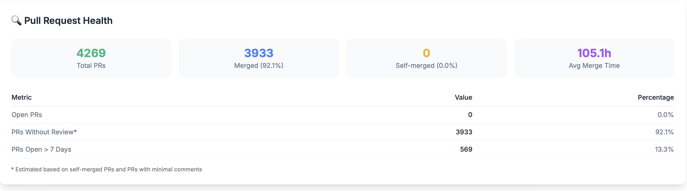

# Pull Request Analytics

GitPulse tracks pull request patterns and metrics to help you understand your team's code review process and collaboration effectiveness.

## Pull Request Overview

Pull request analytics provide insights into how your team reviews code, collaborates on changes, and maintains code quality through the review process.

## PR Cycle Time

### Average Merge Time

The average time between pull request creation and merge, measured in hours. This metric shows how efficiently your team processes pull requests.

<figure markdown="span">
{ width="200" }
<figcaption>Pull Request Cycle Time</figcaption>
</figure>

**What it tells you:**
- Review process efficiency
- Team responsiveness
- Development workflow speed

### Cycle Time Range

The minimum and maximum cycle times show the variability in your review process:
- **Min**: Fastest PR merge time
- **Max**: Slowest PR merge time

**What it tells you:**
- Process consistency
- Bottleneck identification
- Review time variability

### Total PRs Processed

The total number of pull requests that have been processed in the selected time period.

**What it tells you:**
- Overall code review volume
- Team collaboration activity
- Feature development pace

## Pull Request Health

### Total PRs

The total number of pull requests created in the selected time period.

<figure markdown="span">
{ width="400" }
<figcaption>Pull Request Health</figcaption>
</figure>

**What it tells you:**
- Overall code review volume
- Team collaboration activity
- Feature development pace

### Merged PRs

The number and percentage of pull requests successfully merged.

**What it tells you:**
- Successful code integration rate
- Development velocity
- Code review effectiveness

### Self-Merged PRs

The number and percentage of pull requests merged by the same person who created them.

**What it tells you:**
- Code review compliance
- Team collaboration quality
- Potential bypass of review process

### Average Merge Time

The average time it takes to merge pull requests, measured in hours.

**What it tells you:**
- Review process efficiency
- Team responsiveness
- Development workflow speed

## PR Health Metrics

### Open PRs

The number and percentage of pull requests currently open and awaiting review or merge.

**What it tells you:**
- Current review backlog
- Team review capacity
- Code review efficiency

### PRs Without Review

The number and percentage of pull requests that were merged without receiving any reviews.

**What it tells you:**
- Code review compliance
- Quality assurance gaps
- Process bypass patterns

### PRs Open > 7 Days

The number and percentage of pull requests that have been open for more than 7 days.

**What it tells you:**
- Review bottlenecks
- Process inefficiencies
- Potential stale PRs

## PR Health Indicators

### Healthy PR Patterns

✅ **Good signs:**
- High merge rate (>90%)
- Low self-merge rate (<5%)
- Reasonable average merge time (<24h)
- Low percentage of PRs without review
- Few PRs open for extended periods

### Warning Signs

⚠️ **Concerning patterns:**
- High self-merge rate
- Long average merge times
- Many PRs without review
- High number of stale PRs (>7 days)
- Low overall merge rate

## Using PR Data

### For Development Teams

1. **Review Process**: Monitor cycle times and review coverage
2. **Collaboration**: Track self-merge vs. team review patterns
3. **Quality Assurance**: Ensure PRs receive proper reviews
4. **Workflow Optimization**: Identify bottlenecks in review process

### For Management

1. **Process Efficiency**: Assess review workflow effectiveness
2. **Team Collaboration**: Monitor review participation
3. **Quality Control**: Track review compliance
4. **Capacity Planning**: Understand review workload and bottlenecks

## Best Practices

### Improving PR Process

1. **Review Requirements**: Establish mandatory review policies
2. **Timely Reviews**: Set expectations for review response times
3. **Quality Feedback**: Encourage constructive review comments
4. **Process Monitoring**: Track and address bottlenecks

### Team Collaboration

1. **Review Rotation**: Distribute review workload evenly
2. **Knowledge Sharing**: Use reviews for learning and mentoring
3. **Clear Guidelines**: Establish PR creation and review standards
4. **Regular Reviews**: Assess and improve the PR process

## Troubleshooting

### Common Issues

#### High Self-Merge Rate
- **Cause**: Developers bypassing review process
- **Solution**: Establish mandatory review policies and training

#### Long Cycle Times
- **Cause**: Slow review responses or insufficient reviewers
- **Solution**: Set review time expectations and increase reviewer capacity

#### Many PRs Without Review
- **Cause**: Insufficient review requirements or process bypass
- **Solution**: Implement mandatory review policies and monitoring

#### Stale PRs (>7 days)
- **Cause**: Review bottlenecks or abandoned PRs
- **Solution**: Regular PR cleanup and review process optimization

### Getting Help

- **Process Reviews**: Regularly assess PR workflow effectiveness
- **Team Training**: Provide review best practices and guidelines
- **Tool Configuration**: Ensure PR tools support your process
- **Feedback Loops**: Gather team input on process improvements

## 📚 Related Documentation

- **[Commit Frequency](commit-frequency.md)** - Development activity tracking
- **[Repository Overview](overview.md)** - Complete repository analytics
- **[Developer Analytics](../developers/overview.md)** - Individual developer insights 