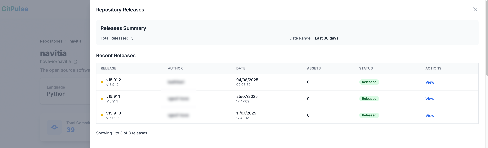
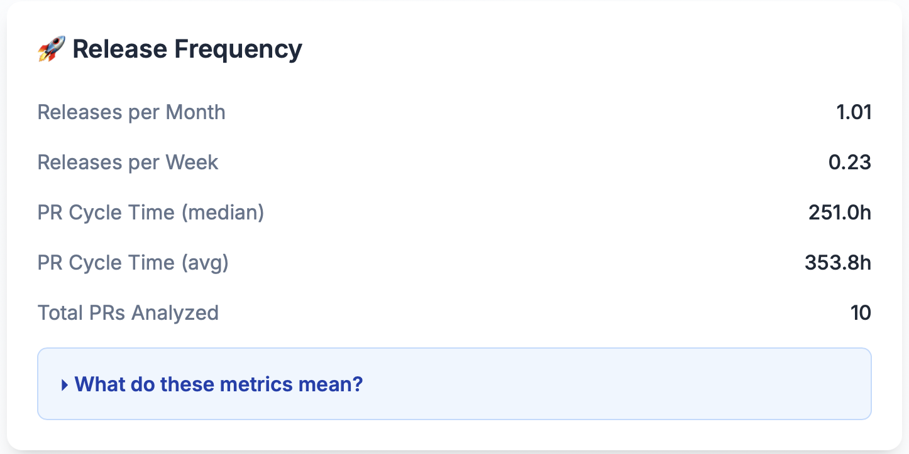

# Release Analytics

GitPulse tracks release patterns and metrics to help you understand your team's deployment frequency and release management effectiveness.

## Release Overview

Release analytics provide insights into how your team ships code, manages deployments, and maintains a consistent release cadence.

## Key Release Metrics

### Total Releases

The total number of releases created in the selected time period. This metric provides a basic count of deployment activity and can be filtered by date range to focus on specific periods.

<figure markdown="span">
{ width="200" }
<figcaption>Total Releases</figcaption>
</figure>

**What it tells you:**
- Overall deployment volume
- Release management activity
- Product delivery pace

### Repository Releases

Click on the Total Releases metric to access a detailed breakdown showing:
- Individual release details and descriptions
- Release dates and version numbers
- Release notes and changelog
- Associated commits and features

<figure markdown="span">
{ width="400" }
<figcaption>Repository Releases Details</figcaption>
</figure>

**What it tells you:**
- Release history and patterns
- Feature delivery timeline
- Release quality and completeness

### Release Frequency

The rate at which releases are created, measured as releases per month and per week.

<figure markdown="span">
{ width="400" }
<figcaption>Release Frequency</figcaption>
</figure>

**What it tells you:**
- Deployment cadence
- Release rhythm and consistency
- Team delivery velocity

## Release Frequency Details

### Releases per Month

The average number of releases created per month over the selected time period.

**What it tells you:**
- Monthly deployment pace
- Release planning effectiveness
- Product delivery rhythm

### Releases per Week

The average number of releases created per week over the selected time period.

**What it tells you:**
- Weekly deployment frequency
- Development velocity
- Release process efficiency

## Release Health Indicators

### Healthy Release Patterns

✅ **Good signs:**
- Consistent release frequency
- Regular deployment cadence
- Clear release notes and documentation
- Stable release process

### Warning Signs

⚠️ **Concerning patterns:**
- Irregular release frequency
- Long periods without releases
- Inconsistent release quality
- Poor release documentation

## Troubleshooting

### Common Issues

#### Irregular Release Frequency
- **Cause**: Inconsistent release planning or process
- **Solution**: Establish regular release cadence and automation

#### Poor Release Documentation
- **Cause**: Insufficient release notes or changelog
- **Solution**: Implement mandatory release documentation

#### Release Bottlenecks
- **Cause**: Manual processes or insufficient testing
- **Solution**: Automate release process and improve testing

### Getting Help

- **Process Reviews**: Regularly assess release workflow
- **Team Training**: Provide release best practices
- **Tool Configuration**: Ensure release tools are optimized
- **Feedback Loops**: Gather team input on release process

## 📚 Related Documentation

- **[Commit Frequency](commit-frequency.md)** - Development activity tracking
- **[Pull Requests](pull-requests.md)** - Code review process
- **[Repository Overview](overview.md)** - Complete repository analytics
- **[Developer Analytics](../developers/overview.md)** - Individual developer insights 