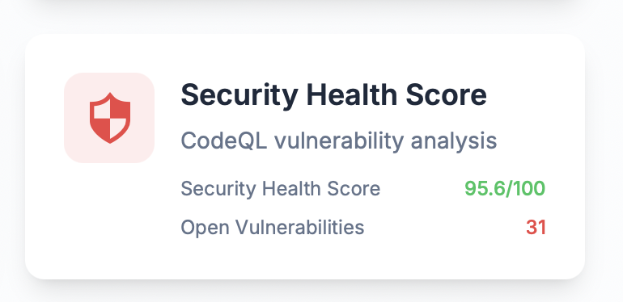
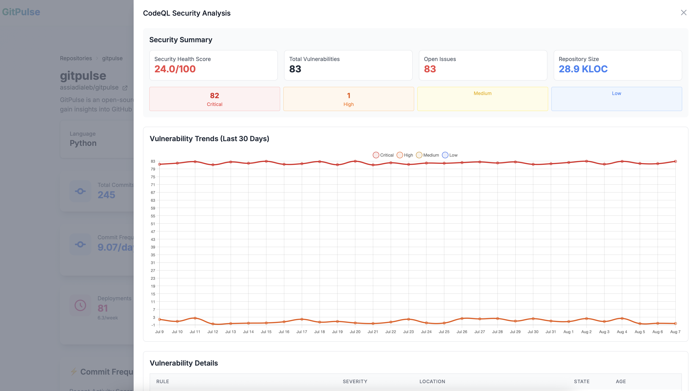

# Security Health Score (SHS)

The Security Health Score is GitPulse's flagship security metric, providing a comprehensive view of your codebase's security posture through advanced vulnerability analysis.

<figure markdown="span">
{ width="200" }
<figcaption>SHS Bloc</figcaption>
</figure>

## Understanding SHS

The SHS is a sophisticated metric that goes beyond simple vulnerability counting. It provides:

- **Normalized Risk Assessment**: Compares security across repositories of different sizes
- **Severity Weighting**: Critical vulnerabilities have more impact than low-severity ones
- **Trend Analysis**: Tracks security improvements over time
- **Actionable Insights**: Helps prioritize security efforts

## How SHS Works

### 1. Vulnerability Analysis
GitPulse analyzes CodeQL vulnerability data from your repositories:
- **Critical Vulnerabilities**: Highest security risk (weight: 1.0)
- **High Vulnerabilities**: Significant security risk (weight: 0.7)
- **Medium Vulnerabilities**: Moderate security risk (weight: 0.4)
- **Low Vulnerabilities**: Minimal security risk (weight: 0.1)

<figure markdown="span">
{ width="400" }
<figcaption>CodeQL analysis result</figcaption>
</figure>

### 2. Size Normalization
The score is normalized by repository size (KLOC - Kilo Lines of Code):
- Larger repositories naturally have more potential vulnerabilities
- Normalization enables fair comparison across different-sized codebases
- Formula: `weighted_vulnerabilities ÷ KLOC`

### 3. Score Calculation
GitPulse applies an exponential decay function to create an intuitive 0-100 scale:
- **Higher scores** = Better security posture
- **Lower scores** = Higher security risk
- **100/100** = Perfect security (no vulnerabilities)
- **0/100** = Critical security issues (many high-severity vulnerabilities)

## Interpreting Your SHS

### Score Ranges

| Score | Security Level | Description | Action Required |
|-------|----------------|-------------|-----------------|
| 90-100 | Excellent | Very low security risk | Maintain current practices |
| 80-89 | Good | Low security risk | Monitor for trends |
| 60-79 | Fair | Moderate security risk | Plan security improvements |
| 40-59 | Poor | High security risk | Immediate attention needed |
| 0-39 | Critical | Very high security risk | Urgent remediation required |

### Trend Indicators

The SHS includes trend information showing security evolution:

- **🟢 Positive Trend** (+2.1): Security is improving
- **🔴 Negative Trend** (-1.5): Security is deteriorating
- **⚪ Stable** (0.0): Security posture is unchanged

## CodeQL Integration

### What is CodeQL?

CodeQL is GitHub's semantic code analysis engine that finds vulnerabilities and errors in your code. GitPulse integrates with CodeQL to provide:

- **Automated Vulnerability Detection**: Finds security issues in your code
- **Severity Classification**: Categorizes vulnerabilities by risk level
- **Detailed Analysis**: Provides context and remediation guidance
- **Continuous Monitoring**: Tracks vulnerabilities over time

## 📚 Related Documentation

- **[CodeQL Integration](codeql-integration.md)** - Vulnerability detection setup
- **[Vulnerability Tracking](vulnerability-tracking.md)** - Severity and remediation
- **[Repository Overview](overview.md)** - Complete repository analytics
- **[Technical SHS Documentation](../../technical/security-health-score.md)** - Implementation details 