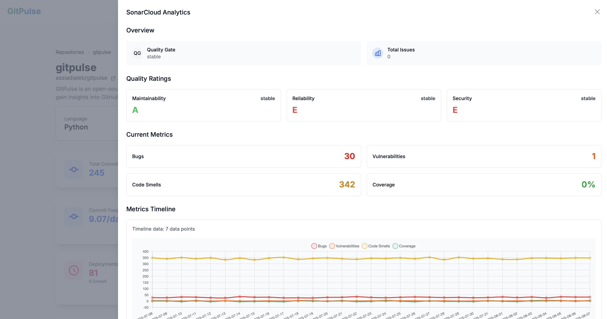

# SonarCloud Metrics

GitPulse integrates with SonarCloud to provide comprehensive code quality analysis, helping you maintain high standards across your codebase.

## Code Quality Overview

SonarCloud analyzes your code for quality, reliability, and security issues, providing actionable insights to improve your codebase health.

<figure markdown="span">
{ width="400" }
<figcaption>SonarCloud Code Quality Dashboard</figcaption>
</figure>

## Key Quality Metrics

### Maintainability Rating

The maintainability rating evaluates code complexity and technical debt:

- **A (Excellent)**: Very low complexity, easy to maintain
- **B (Good)**: Low complexity, manageable
- **C (Fair)**: Moderate complexity, some technical debt
- **D (Poor)**: High complexity, significant technical debt
- **E (Critical)**: Very high complexity, difficult to maintain

**What it measures:**
- Code complexity (cyclomatic complexity)
- Code duplication
- Technical debt ratio
- Code smells and anti-patterns

### Reliability Rating

The reliability rating assesses code stability and bug density:

- **A (Excellent)**: Very few bugs, highly reliable
- **B (Good)**: Low bug density, reliable
- **C (Fair)**: Moderate bug density
- **D (Poor)**: High bug density, unstable
- **E (Critical)**: Very high bug density, unreliable

**What it measures:**
- Bug density
- Code coverage
- Test quality
- Error handling

### Security Rating

The security rating evaluates security vulnerabilities and hotspots:

- **A (Excellent)**: Very few security issues
- **B (Good)**: Low security risk
- **C (Fair)**: Moderate security concerns
- **D (Poor)**: High security risk
- **E (Critical)**: Critical security vulnerabilities

**What it measures:**
- Security hotspots
- Vulnerability density
- Security rule violations
- OWASP compliance

### Security Review Rating

Additional security analysis focusing on:

- **A (Excellent)**: No security hotspots
- **B (Good)**: Few security hotspots
- **C (Fair)**: Some security concerns
- **D (Poor)**: Many security hotspots
- **E (Critical)**: Critical security hotspots

## Quality Gate Status

Each repository shows a quality gate status indicating overall code quality:

### Pass Criteria
- **Maintainability**: A or B rating
- **Reliability**: A or B rating  
- **Security**: A or B rating
- **Security Review**: A or B rating
- **Coverage**: Meets minimum threshold
- **Duplications**: Below maximum threshold

### Fail Criteria
- Any metric below the minimum threshold
- Critical issues that must be addressed
- Security vulnerabilities requiring immediate attention

## Detailed Analysis

### Code Smells

Code smells indicate potential problems in your code:

- **Long Methods**: Methods that are too complex
- **Large Classes**: Classes with too many responsibilities
- **Duplicated Code**: Code that could be refactored
- **Complex Conditions**: Overly complex conditional logic
- **Magic Numbers**: Hard-coded values that should be constants

### Technical Debt

Technical debt represents the cost of maintaining code:

- **Remediation Cost**: Time to fix all issues
- **Interest**: Additional cost of not fixing issues
- **Principal**: Original cost of shortcuts taken
- **Ratio**: Technical debt relative to development cost

### Code Coverage

Test coverage measures how well your code is tested:

- **Line Coverage**: Percentage of lines executed by tests
- **Branch Coverage**: Percentage of branches executed by tests
- **Function Coverage**: Percentage of functions called by tests
- **Statement Coverage**: Percentage of statements executed by tests

## Setting Up SonarCloud

### 1. Create SonarCloud Account

1. Go to [SonarCloud](https://sonarcloud.io)
2. Sign up with your GitHub account
3. Create an organization for your projects

### 2. Configure Repository

1. Add your repository to SonarCloud
2. Configure analysis settings
3. Set up quality gate criteria
4. Enable automatic analysis

### 3. Integrate with GitPulse

1. Ensure SonarCloud analysis is running
2. Index your repository in GitPulse
3. SonarCloud data will be automatically imported

## Quality Gate Configuration

### Default Thresholds

- **Maintainability**: A or B rating
- **Reliability**: A or B rating
- **Security**: A or B rating
- **Security Review**: A or B rating
- **Coverage**: 80% minimum
- **Duplications**: 3% maximum

### Custom Configuration

You can customize quality gate criteria:

1. **Adjust Thresholds**: Modify minimum requirements
2. **Add Custom Rules**: Include project-specific criteria
3. **Set Priorities**: Define which issues block the gate
4. **Configure Alerts**: Set up notifications for failures

## Best Practices

### Improving Code Quality

1. **Regular Reviews**: Check SonarCloud reports weekly
2. **Fix Critical Issues**: Address A and B rated problems first
3. **Refactor Complex Code**: Break down large methods and classes
4. **Add Tests**: Increase code coverage to 80% or higher
5. **Remove Duplications**: Consolidate repeated code

### Team Collaboration

1. **Code Reviews**: Include SonarCloud issues in reviews
2. **Sprint Planning**: Allocate time for technical debt
3. **Quality Goals**: Set team targets for ratings
4. **Knowledge Sharing**: Share best practices for clean code

### Continuous Improvement

1. **Monitor Trends**: Track quality metrics over time
2. **Set Goals**: Establish quality improvement targets
3. **Celebrate Success**: Recognize quality improvements
4. **Learn from Issues**: Use problems as learning opportunities

## Troubleshooting

### Common Issues

#### Missing SonarCloud Data
- **Cause**: SonarCloud not configured or analysis failed
- **Solution**: Check SonarCloud project status and configuration

#### Quality Gate Always Failing
- **Cause**: Thresholds too strict or many issues
- **Solution**: Adjust quality gate criteria or fix critical issues

#### Outdated Metrics
- **Cause**: SonarCloud analysis not running regularly
- **Solution**: Check SonarCloud configuration and triggers

### Getting Help

- **SonarCloud Documentation**: [docs.sonarqube.org](https://docs.sonarqube.org)
- **Quality Gate Guide**: [Quality Gate Documentation](https://docs.sonarqube.org/latest/user-guide/quality-gates/)
- **Community Support**: SonarCloud community forums

## Advanced Features

### Custom Rules

- **Project-Specific Rules**: Create rules for your coding standards
- **Custom Quality Profiles**: Define your own quality criteria
- **Rule Templates**: Share rules across projects

### Integration Options

- **CI/CD Integration**: Automatic analysis in pipelines
- **IDE Integration**: Real-time feedback in your editor
- **API Access**: Programmatic access to quality data
- **Webhook Notifications**: Real-time quality alerts

## 📚 Related Documentation

- **[Repository Overview](overview.md)** - Complete repository analytics
- **[Security Health Score](security-health-score.md)** - Security metrics
- **[Quality Gates](quality-gates.md)** - Pass/fail criteria
- **[Technical Debt](technical-debt.md)** - Code complexity analysis 